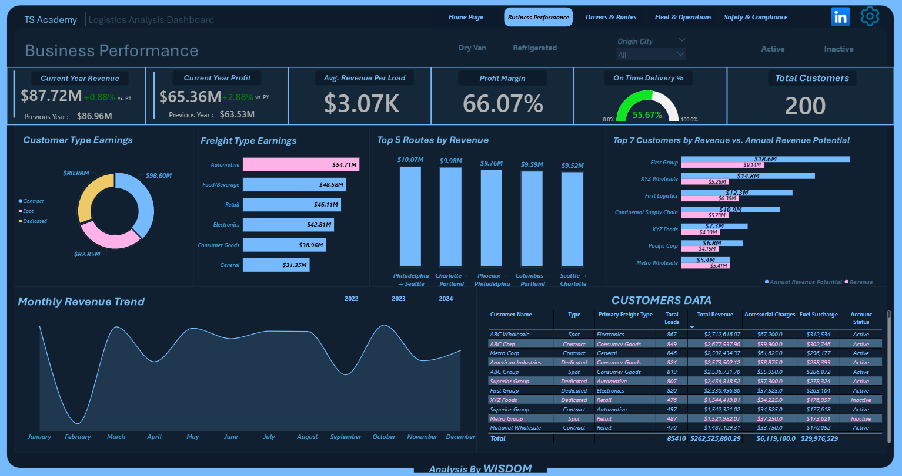
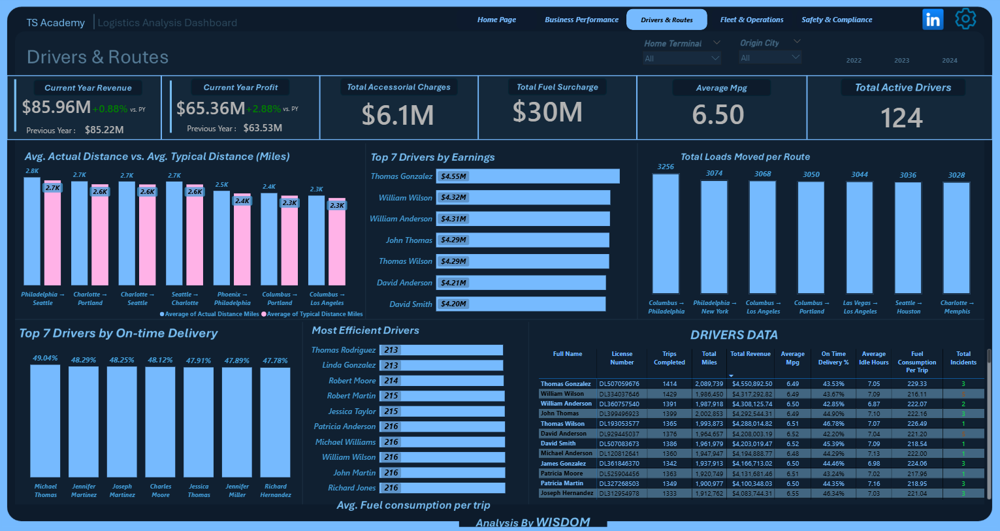
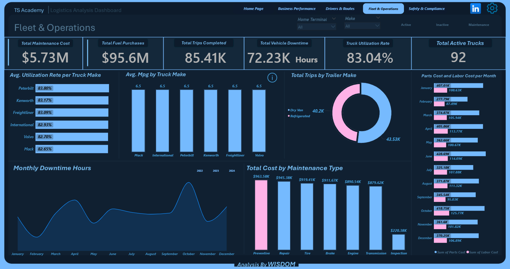
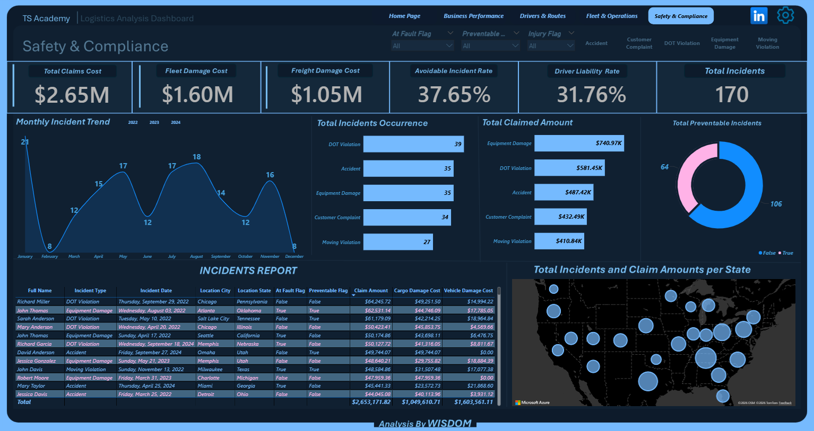
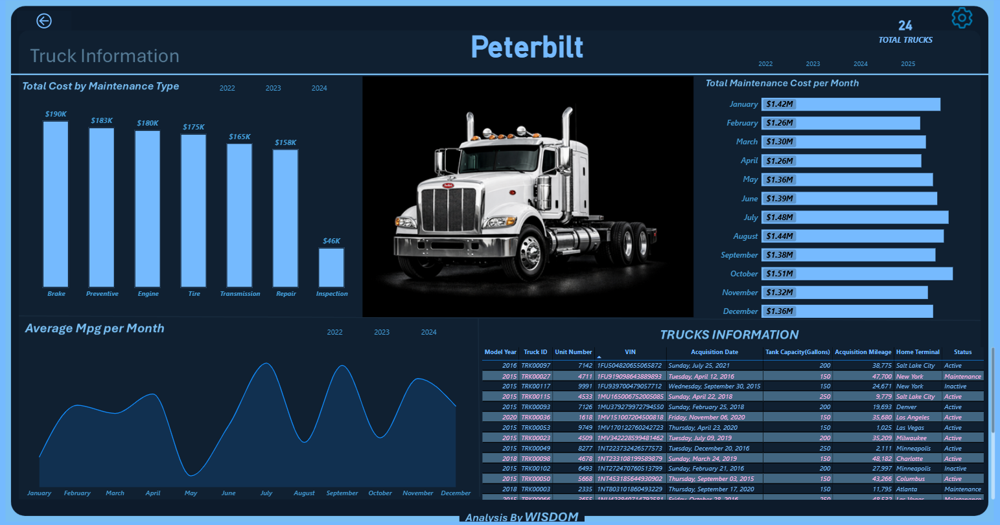

# Logistics Operations Dashboard — Power BI Capstone Project

---

## 🔴 Live Interactive Dashboard
👉 [Click here to view the fully interactive dashboard](https://bit.ly/4datfMv)

## 📸 Screenshots & LinkedIn Post
🔗 [View Dashboard Screenshots on LinkedIn](https://www.linkedin.com/posts/chidera-okpala-22417730a_powerbi-dataanalytics-datavisualization-ugcPost-7464011477541122048-3-Mf/?utm_source=share&utm_medium=member_desktop&rcm=ACoAAE6w03wBP8IkgWE3bRhE1kJdUlfQmNunzig)

---

## 📌 Project Overview

This project presents a comprehensive logistics operations 
analysis built using Microsoft Power BI as a Capstone Project 
with TS Academy.

The dataset contains operational data across 14 interconnected 
tables including:

- Trips & Loads
- Drivers & Driver Monthly Metrics
- Trucks & Truck Utilization Metrics
- Routes & Customers
- Fuel Purchases & Maintenance Records
- Safety Incidents & Delivery Events
- Trailers & Facilities

The primary objective of this analysis was to evaluate:

- Revenue and profit performance year-over-year
- Driver productivity and fuel efficiency
- Fleet utilization and maintenance costs
- Route efficiency across the US
- Safety incident patterns and compliance costs

---

## 🗂️ Dataset Summary

| Metric | Value |
|---|---|
| Total Revenue | $298.62M |
| Total Profit | $197.3M |
| Profit Margin | 66.07% |
| Total Trips | 85,410 |
| Total Active Drivers | 124 |
| Total Active Trucks | 92 |
| Total Incidents | 170 |
| Total Claims Cost | $2.65M |
| Total Fuel Purchases | $95.6M |
| Total Maintenance Cost | $5.73M |
| On-Time Delivery Rate | 55.67% |
| Date Range | 2022 - 2024 |
| Total Tables | 14 |

---

## 🧹 Data Preparation & Modelling

The dataset was modelled in Power BI Desktop where the 
following steps were carried out:

- Connected 14 tables using a star schema structure
  centered around the Trips table as the primary fact table
- Established one-to-many relationships across all tables
- Fixed filter directions to flow from dimension tables
  to fact tables
- Created a Route Label calculated column combining
  Origin City and Destination City for route analysis
- Created DAX measures for YOY Revenue, YOY Profit,
  Fuel Consumption Per Trip, On-Time Delivery %,
  Preventable Incident Rate, and Driver Liability Rate
- Applied conditional formatting using color measures
  for positive and negative YOY indicators
- All relationships confirmed as single direction to
  avoid ambiguous filter propagation

---

## ❓ Business Problem

The business lacked a clear, consolidated view of how 
logistics operations were performing across drivers, 
trucks, routes, customers, and safety compliance.

Specifically, the business could not answer:

1. Are we growing year over year — and by how much?
2. Which drivers are generating the most revenue
   and which are the most fuel efficient?
3. Which truck makes are underperforming in
   utilization and maintenance costs?
4. Which routes are running longer than their
   typical distance?
5. Where are safety incidents concentrated and
   what is the financial cost?

---

## 🔍 Insight Questions Explored

1. What is the year-over-year change in Revenue and Profit?
2. Which drivers generate the highest revenue and
   maintain the best on-time delivery rate?
3. Which truck make has the highest utilization rate
   and lowest downtime?
4. Which routes have the biggest gap between actual
   and typical distance?
5. What is the monthly trend for fuel costs and
   maintenance costs?
6. Which incident types are most frequent and
   most costly?
7. Which customers generate the most revenue and
   how does it compare to their annual revenue potential?

---

## 📊 Dashboard Preview

### Business Performance

### Drivers & Routes

### Fleet & Operations

### Safety & Compliance

### Truck Info

---

## 🧩 Dashboard Components

### 💼 Business Performance

| Visual | Description |
|---|---|
| 6 KPI Cards | Current Year Revenue, Current Year Profit, Avg Revenue Per Load, Profit Margin, On-Time Delivery %, Total Customers — each with YOY indicator |
| Customer Type Earnings | Donut chart showing revenue split across Contract, Spot and Dedicated customers |
| Freight Type Earnings | Bar chart showing revenue by primary freight type |
| Top 5 Routes by Revenue | Bar chart showing highest earning routes |
| Top 7 Customers vs Annual Potential | Clustered bar comparing actual revenue against revenue potential |
| Monthly Revenue Trend | Line chart showing revenue performance across all months |
| Customer Data Table | Full breakdown of customer name, type, freight type, total loads, revenue, charges and account status |
| Slicers | Load Type, Customer Type, Origin City, Account Status |

---

### 🚛 Drivers & Routes

| Visual | Description |
|---|---|
| 6 KPI Cards | Current Year Revenue, Current Year Profit, Total Accessorial Charges, Total Fuel Surcharge, Average MPG, Total Active Drivers — each with YOY indicator |
| Avg Actual vs Typical Distance | Clustered bar comparing actual trip distance against typical route distance |
| Top 7 Drivers by Earnings | Bar chart showing highest revenue generating drivers |
| Total Loads Moved per Route | Bar chart showing route volume |
| Top 7 Drivers by On-Time Delivery | Bar chart showing best performing drivers by delivery punctuality |
| Most Efficient Drivers | Bar chart showing lowest fuel consumption per trip |
| Driver Data Table | Full breakdown of driver name, license number, trips completed, total miles, revenue, MPG, on-time rate, idle hours, fuel per trip and total incidents |
| Slicers | Home Terminal, Origin City, Year |

---

### ⚙️ Fleet & Operations

| Visual | Description |
|---|---|
| 6 KPI Cards | Total Maintenance Cost, Total Fuel Purchases, Total Trips Completed, Total Vehicle Downtime, Truck Utilization Rate, Total Active Trucks |
| Avg Utilization Rate by Make | Bar chart showing utilization performance per truck make |
| Avg MPG by Truck Make | Bar chart comparing fuel efficiency across makes |
| Total Trips by Trailer Type | Donut chart showing Dry Van vs Refrigerated trailer usage |
| Parts Cost vs Labor Cost by Month | Clustered bar showing monthly maintenance cost breakdown |
| Monthly Downtime Hours | Line chart tracking downtime trends across the year |
| Total Cost by Maintenance Type | Bar chart showing cost breakdown by maintenance category |
| Slicers | Home Terminal, Make, Status, Year |
| Drillthrough | Truck Make Detail page for in-depth per-make analysis |

---

### 🛡️ Safety & Compliance

| Visual | Description |
|---|---|
| 6 KPI Cards | Total Claims Cost, Fleet Damage Cost, Freight Damage Cost, Avoidable Incident Rate, Driver Liability Rate, Total Incidents |
| Monthly Incident Trend | Line chart tracking incident frequency across months |
| Total Incidents by Type | Bar chart showing breakdown of incident categories |
| Total Claimed Amount by Type | Bar chart showing financial cost per incident type |
| Total Preventable Incidents | Donut chart comparing preventable vs non-preventable incidents |
| Incidents & Claims per State | Geographic bubble map showing incident concentration across the US |
| Incidents Report Table | Full breakdown of driver name, incident type, date, location, at fault flag, preventable flag, claim amount, cargo damage and vehicle damage cost |
| Slicers | At Fault Flag, Preventable Flag, Injury Flag, Incident Type |

---

## 🔑 Key Findings

### 1. Strong Year-Over-Year Revenue Growth
| Metric | YOY Change |
|---|---|
| Revenue | +0.88% |
| Profit | +2.88% |

Profit is growing faster than revenue — a sign that 
operational efficiency is improving.

### 2. Driver Performance is Concentrated
The top 10 drivers account for a disproportionate share 
of total revenue. Thomas Gonzalez leads with $4.55M in 
revenue across 1,414 trips while maintaining a 6.49 
average MPG.

### 3. Peterbilt Leads Fleet Utilization
Peterbilt trucks recorded the highest average utilization 
rate at 83.80% followed closely by Kenworth at 83.17%. 
Mack recorded the lowest at 82.65%.

### 4. Machines Maintenance is the Biggest Cost Driver
Preventive maintenance accounts for the highest total 
cost at $963.58K followed by Repair at $945.38K and 
Tire at $919.41K — highlighting where maintenance 
budget is being consumed.

### 5. Safety Incidents are Financially Significant
170 total incidents generated $2.65M in total claims 
cost. Equipment Damage is the most expensive incident 
type at $740.97K in claims. DOT Violations are the 
most frequent incident type with 39 occurrences.

### 6. On-Time Delivery Rate Needs Improvement
An overall on-time delivery rate of 55.67% indicates 
significant room for improvement in delivery 
scheduling and route planning.

### 7. New York City is the Top Revenue City
New York City leads all cities in revenue contribution 
significantly ahead of other major cities across 
the network.

---

## ⚠️ Limitations

- Dataset covers 2022 to 2024 only — longer historical 
  trends cannot be evaluated
- Driver salary and wage cost data is not available — 
  profit calculations exclude labour costs
- On-time delivery rate of 55.67% may reflect data 
  quality issues in the Delivery Events table rather 
  than actual operational performance
- Safety incident data contains only 170 records which 
  may not fully represent the complete incident history
- Facilities table is only connected through Delivery 
  Events limiting direct facility performance analysis

---

## 🚀 Recommendations

### 1. Investigate On-Time Delivery Performance
A 55.67% on-time rate is below industry standard. 
A full review of route scheduling, driver assignments 
and delivery windows is recommended immediately.

### 2. Reduce Preventive Maintenance Costs
At $963.58K, preventive maintenance is the single 
largest cost category. Review maintenance schedules 
and intervals to identify cost reduction opportunities 
without compromising fleet safety.

### 3. Address High Idle Time Drivers
Drivers with consistently high idle hours are 
directly increasing fuel costs. A targeted coaching 
programme for the highest idlers could deliver 
meaningful fuel savings.

### 4. Focus Safety Improvements on Equipment Damage
Equipment Damage generates the highest claim costs 
at $740.97K. Targeted driver training and pre-trip 
inspection protocols could significantly reduce 
this cost.

### 5. Invest in Top Performing Routes
Routes with the highest revenue and closest actual 
to typical distance ratios represent the most 
efficient operations. Prioritise capacity on these 
routes to maximise profitability.

---

## 🛠️ Tools & Skills Used

Microsoft Power BI Desktop
- Data Modelling — 14 table star schema
- DAX Measures & Calculated Columns
- YOY Revenue & Profit Analysis
- Conditional Formatting with Color Measures
- Interactive Drillthrough Pages
- Tooltip Pages
- Data Visualization & Storytelling
- Map Visuals for Geographic Analysis

---

## 📝 Conclusion

This Logistics Operations Dashboard transforms data 
across 14 interconnected tables into a clear, 
interactive view of business performance. The analysis 
reveals a business that is growing — but one where 
on-time delivery, maintenance costs, and safety 
incidents represent the biggest opportunities for 
improvement.

The data does not make decisions but it removes 
every excuse for making bad ones.

---

## 🙏 Acknowledgements

Special thanks to TS Academy for the scholarship 
opportunity and for believing in people enough to 
invest in their growth. And to my tutor Ezekiel Aleke, 
thank you for the guidance, patience and support 
throughout this journey — it made all the difference.

---

## 🔗 Connect With Me

[LinkedIn](https://www.linkedin.com/posts/chidera-okpala-22417730a_powerbi-dataanalytics-datavisualization-ugcPost-7464011477541122048-3-Mf/?utm_source=share&utm_medium=member_desktop&rcm=ACoAAE6w03wBP8IkgWE3bRhE1kJdUlfQmNunzig)
